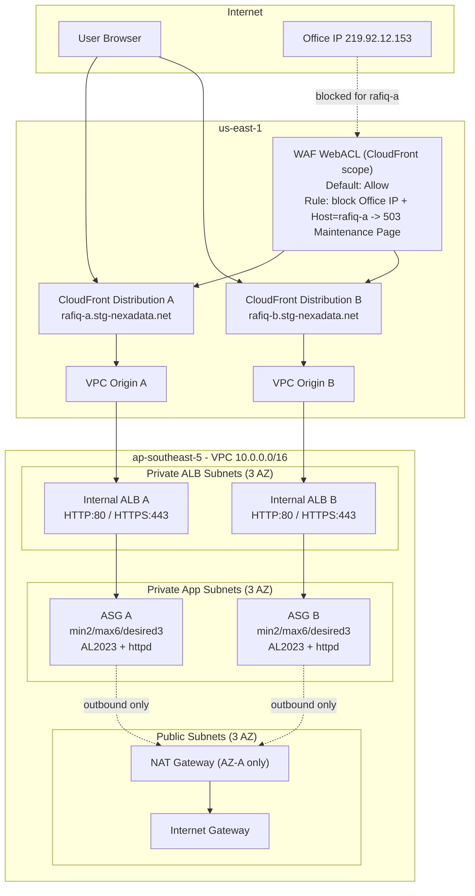

# Rafiq Lab — Multi-Region AWS Infrastructure (CloudFront + WAF + Internal ALB + ASG)

A 3-tier AWS lab built with CloudFormation, demonstrating a private compute
layer (internal ALBs + Auto Scaling Groups) fronted by CloudFront using
**VPC Origins** (no public-facing load balancer), protected by AWS WAF.

The stack is split into 3 independently deployable CloudFormation templates
and spans two regions on purpose: the compute layer lives in
`ap-southeast-5`, while CloudFront/WAF resources must be declared in
`us-east-1` (an AWS requirement for CloudFront-scoped WAF WebACLs and ACM
certificates used by CloudFront).

## Architecture



VPC layout (`10.0.0.0/16`, 3 Availability Zones):

| Tier              | CIDR blocks                          | Purpose                          |
|-------------------|---------------------------------------|-----------------------------------|
| Public             | 10.0.1.0/24, 10.0.2.0/24, 10.0.3.0/24   | NAT Gateway, Internet Gateway route |
| Private (ALB)      | 10.0.11.0/24, 10.0.12.0/24, 10.0.13.0/24 | Internal Application Load Balancers |
| Private (App)      | 10.0.21.0/24, 10.0.22.0/24, 10.0.23.0/24 | EC2 instances (Auto Scaling Groups) |

## Stacks

| # | Template | Region | Deploys | Depends on |
|---|-----------|--------|---------|------------|
| 1 | `01-network.yaml` | `ap-southeast-5` | VPC, 3 AZ subnets, IGW, NAT Gateway, route tables | — |
| 2 | `02-compute.yaml` | `ap-southeast-5` | Internal ALBs (A/B), Target Groups, Launch Templates, Auto Scaling Groups, IAM role (SSM only) | Stack 1 (via `Fn::ImportValue`) |
| 3 | `03-cdn-waf.yaml` | `us-east-1` | CloudFront distributions (A/B) with VPC Origins, WAF WebACL, maintenance-page rule | Stack 2 (ALB DNS names / ARNs — see note below) |

### Notes on stack 3's origin values

`03-cdn-waf.yaml` currently takes the compute stack's ALB DNS names and ARNs
as **parameters with hardcoded defaults**, rather than importing them
automatically. This is because CloudFormation `Fn::ImportValue` only works
within the same region, and stack 3 deploys in `us-east-1` while stack 2
deploys in `ap-southeast-5`.

When redeploying stack 2, fetch the new values and pass them explicitly to
stack 3:

```powershell
aws cloudformation describe-stacks --stack-name rafiq-lab-compute --region ap-southeast-5 `
  --query "Stacks[0].Outputs" --output table
```

Then override `ALBADnsName`, `ALBBDnsName`, `ALBAArnValue`, `ALBBArnValue` in
the stack 3 deploy command with the fresh values.

## Security design

- **No public load balancer.** ALBs are `internal` scheme, reachable only via
  CloudFront VPC Origins.
- **EC2 has no SSH access and no key pair.** Instances are managed exclusively
  through **AWS Systems Manager Session Manager** (`AmazonSSMManagedInstanceCore`
  policy on the instance role).
- **Security group chaining:** the EC2 security group only accepts traffic
  from the ALB security group (`SourceSecurityGroupId`), not from a CIDR
  range.
- **WAF WebACL** (CloudFront scope) default-allows all traffic and adds a
  single narrow rule: block traffic from a specific office IP *and* targeting
  the `rafiq-a` host, returning a custom 503 maintenance page. This is used to
  hide the app from an internal office network during maintenance windows
  without impacting real users.
- **TLS everywhere:** CloudFront enforces `redirect-to-https` with
  TLSv1.2_2021 minimum, and the ALB listeners terminate HTTPS using a
  region-specific ACM certificate (separate from the CloudFront/us-east-1
  certificate, as required by AWS).

## Deploying

Requires the [AWS CLI](https://aws.amazon.com/cli/) configured with
credentials that have permission to manage VPC, EC2, ELB, Auto Scaling, IAM,
CloudFront, and WAF resources (`aws configure`).

> Do not commit AWS credentials to this repository. Configure the CLI
> locally or use a secrets manager / environment variables instead.

```powershell
# 1. Network stack
aws cloudformation deploy `
  --stack-name rafiq-lab-network `
  --template-file 01-network.yaml `
  --region ap-southeast-5 `
  --parameter-overrides EnvironmentName=rafiq-lab

# 2. Compute stack (creates an IAM role, needs named-IAM capability)
aws cloudformation deploy `
  --stack-name rafiq-lab-compute `
  --template-file 02-compute.yaml `
  --region ap-southeast-5 `
  --capabilities CAPABILITY_NAMED_IAM `
  --parameter-overrides EnvironmentName=rafiq-lab

# 3. CDN + WAF stack (deployed in us-east-1 — required for CloudFront/WAF)
aws cloudformation deploy `
  --stack-name rafiq-lab-cdn-waf `
  --template-file 03-cdn-waf.yaml `
  --region us-east-1 `
  --capabilities CAPABILITY_IAM `
  --parameter-overrides EnvironmentName=rafiq-lab
```

### Validate stack status

```powershell
aws cloudformation describe-stacks --stack-name rafiq-lab-cdn-waf --region us-east-1 --query "Stacks[0].StackStatus" --output text
aws cloudformation describe-stacks --stack-name rafiq-lab-compute --region ap-southeast-5 --query "Stacks[0].StackStatus" --output text
aws cloudformation describe-stacks --stack-name rafiq-lab-network --region ap-southeast-5 --query "Stacks[0].StackStatus" --output text
```

## Tearing down

Delete in reverse order of creation (dependents first):

```powershell
aws cloudformation delete-stack --stack-name rafiq-lab-cdn-waf --region us-east-1
aws cloudformation delete-stack --stack-name rafiq-lab-compute --region ap-southeast-5
aws cloudformation delete-stack --stack-name rafiq-lab-network --region ap-southeast-5
```

## Known limitations

- **Single NAT Gateway.** Only `PublicSubnetA` has a NAT Gateway, so if that
  AZ has an outage, private subnets in the other two AZs lose outbound
  internet access. Acceptable for a lab; a production build should use one
  NAT Gateway per AZ.
- **Cross-region parameter wiring.** As noted above, stack 3's origin values
  are passed as parameters rather than resolved automatically, since
  `Fn::ImportValue` cannot cross regions.
- **ALB security group** allows the full VPC CIDR (`10.0.0.0/16`) on ports
  80/443 rather than being scoped to just the CloudFront VPC Origin ENIs or
  the private-ALB subnet ranges.

## Repository structure

```
lab-challenge/
├── 01-network.yaml       # VPC, subnets, NAT, routing
├── 02-compute.yaml       # Internal ALBs, ASGs, EC2, IAM
├── 03-cdn-waf.yaml       # CloudFront distributions + WAF
└── README.md             # This file
```
